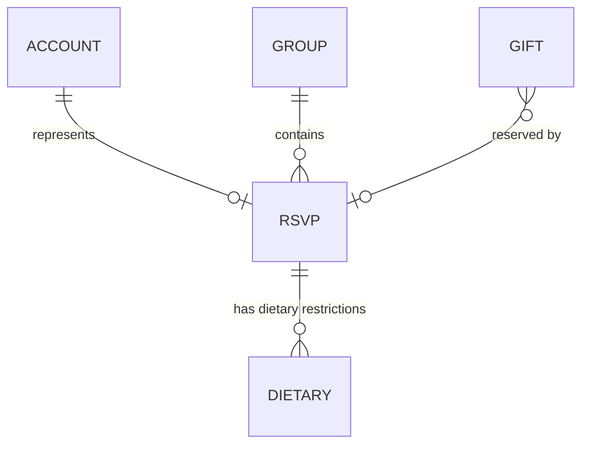

# MongoDB & Mongoose Entities Plan

This document outlines the Mongoose models and schemas required for the Baby Shower application based on the existing React components and workflows.

---

## 1. Database Entity Architecture



To support authentication, guest grouping, dietary filtering, and registry reservations, we define four main collections:
1. **`Account`**: Handles login/authentication for admin dashboards and registered users.
2. **`Group`**: Groups multiple guests together (e.g., family or couples) under a single invitation code for easy lookup.
3. **`Dietary`**: Stores dietary choices/categories (e.g., Vegetarian, Vegan, Gluten-Free) and custom notes.
4. **`Gift`**: Represents the registry items that guests can view, add, edit, or reserve.

---

## 2. Mongoose Schemas & TypeScript Interfaces

### A. Account Entity
Represents users (such as administrators who manage the registry/guest lists, and registered guests).

```typescript
import mongoose, { Schema, Document, Model } from 'mongoose';

export interface IAccount extends Document {
  email: string;
  passwordHash: string;
  role: 'admin' | 'guest';
  firstName: string;
  lastName: string;
  rsvpProfile?: mongoose.Types.ObjectId; // Links to RSVP if they are a guest
  lastLogin?: Date;
  createdAt: Date;
  updatedAt: Date;
}

const AccountSchema = new Schema<IAccount>(
  {
    email: {
      type: String,
      required: [true, 'Email is required'],
      unique: true,
      trim: true,
      lowercase: true,
      match: [/^\S+@\S+\.\S+$/, 'Please use a valid email address'],
    },
    passwordHash: {
      type: String,
      required: [true, 'Password hash is required'],
      select: false, // Do not return password hash in queries by default
    },
    role: {
      type: String,
      enum: ['admin', 'guest'],
      default: 'guest',
    },
    firstName: {
      type: String,
      required: [true, 'First name is required'],
      trim: true,
    },
    lastName: {
      type: String,
      required: [true, 'Last name is required'],
      trim: true,
    },
    rsvpProfile: {
      type: Schema.Types.ObjectId,
      ref: 'RSVP',
    },
    lastLogin: {
      type: Date,
    },
  },
  {
    timestamps: true,
  }
);

// Indexes for fast lookups
AccountSchema.index({ email: 1 });

export const Account: Model<IAccount> =
  mongoose.models.Account || mongoose.model<IAccount>('Account', AccountSchema);
```

---

### B. Group Entity
Allows guests to be grouped together (e.g., "The Smiths" or "Alice & Bob"). This is highly useful for lookup and mass RSVP features.

```typescript
import mongoose, { Schema, Document, Model } from 'mongoose';

export interface IGroup extends Document {
  name: string;
  invitationCode: string; // Short code to search, e.g. "BEACH2026"
  maxGuestsAllowed: number; // Max capacity allowed for this group
  members: mongoose.Types.ObjectId[]; // Array of RSVP references
  createdAt: Date;
  updatedAt: Date;
}

const GroupSchema = new Schema<IGroup>(
  {
    name: {
      type: String,
      required: [true, 'Group name is required (e.g., The Smiths)'],
      trim: true,
    },
    invitationCode: {
      type: String,
      required: [true, 'Invitation code is required'],
      unique: true,
      trim: true,
      uppercase: true,
    },
    maxGuestsAllowed: {
      type: Number,
      default: 2,
      min: [1, 'Must allow at least 1 guest'],
    },
    members: [
      {
        type: Schema.Types.ObjectId,
        ref: 'RSVP',
      },
    ],
  },
  {
    timestamps: true,
  }
);

// Indexes
GroupSchema.index({ invitationCode: 1 });

export const Group: Model<IGroup> =
  mongoose.models.Group || mongoose.model<IGroup>('Group', GroupSchema);
```

---

### C. RSVP (Guest) & Dietary Entities
To match your React forms (which support multiple dietary checkmarks and custom notes), we separate these into:
1. **`RSVP`**: Core attendance profile.
2. **`Dietary`**: A reference lookup or sub-document storing dietary constraints.

#### RSVP Schema
```typescript
import mongoose, { Schema, Document, Model } from 'mongoose';

export interface IRSVP extends Document {
  firstName: string;
  lastName: string;
  attending: boolean;
  guests: number;
  dietaryRestrictions: mongoose.Types.ObjectId[]; // References to Dietary collection
  otherDietNotes?: string; // Captures 'otherDiet' textarea value
  arrivalTime?: string; // e.g., "12:30 PM" or "13:00"
  reservedGift?: mongoose.Types.ObjectId; // References the Gift they reserved
  group?: mongoose.Types.ObjectId; // Optional group ownership
  createdAt: Date;
  updatedAt: Date;
}

const RSVPSchema = new Schema<IRSVP>(
  {
    firstName: {
      type: String,
      required: [true, 'First name is required'],
      trim: true,
    },
    lastName: {
      type: String,
      required: [true, 'Last name is required'],
      trim: true,
    },
    attending: {
      type: Boolean,
      required: [true, 'Attendance selection is required'],
      default: false,
    },
    guests: {
      type: Number,
      required: true,
      min: [1, 'Must have at least 1 attendee'],
      max: [10, 'Max 10 guests allowed per submission'],
      default: 1,
    },
    dietaryRestrictions: [
      {
        type: Schema.Types.ObjectId,
        ref: 'Dietary',
      },
    ],
    otherDietNotes: {
      type: String,
      trim: true,
    },
    arrivalTime: {
      type: String,
      trim: true,
    },
    reservedGift: {
      type: Schema.Types.ObjectId,
      ref: 'Gift',
    },
    group: {
      type: Schema.Types.ObjectId,
      ref: 'Group',
    },
  },
  {
    timestamps: true,
  }
);

// Indexes for the "Find My RSVP" flow (case-insensitive searches)
RSVPSchema.index({ firstName: 1, lastName: 1 });

export const RSVPModel: Model<IRSVP> =
  mongoose.models.RSVP || mongoose.model<IRSVP>('RSVP', RSVPSchema);
```

#### Dietary Option Schema
Allows dynamic configuration of dietary options (like Vegetarian, Nut Allergy) to avoid hardcoding labels and icons in code.

```typescript
export interface IDietary extends Document {
  key: string; // e.g., 'vegetarian', 'nut-allergy'
  label: string; // e.g., 'Vegetarian', 'Nut Allergy'
  icon?: string; // e.g., '🌱', '🌰'
}

const DietarySchema = new Schema<IDietary>({
  key: {
    type: String,
    required: true,
    unique: true,
    lowercase: true,
    trim: true,
  },
  label: {
    type: String,
    required: true,
    trim: true,
  },
  icon: {
    type: String,
    trim: true,
  },
});

export const Dietary: Model<IDietary> =
  mongoose.models.Dietary || mongoose.model<IDietary>('Dietary', DietarySchema);
```

---

### D. Gift (Registry Item) Entity
Directly maps to the registry grid items and the reservation system.

```typescript
import mongoose, { Schema, Document, Model } from 'mongoose';

export interface IGift extends Document {
  name: string;
  category: 'nursery' | 'beach' | 'feeding' | 'care' | string;
  price: string; // Stored as a string to accommodate ranges/symbols, e.g. "$32"
  icon: 'wave' | 'moon' | 'palm' | 'tent' | 'bottle' | 'bib' | 'caddy' | 'bath' | 'star' | 'shirt' | 'cloth' | 'firstaid' | string;
  note: string;
  reserved: boolean;
  reservedBy?: mongoose.Types.ObjectId; // References the RSVP guest
  reservedAt?: Date;
  url?: string;
  imageUrl?: string;
  createdAt: Date;
  updatedAt: Date;
}

const GiftSchema = new Schema<IGift>(
  {
    name: {
      type: String,
      required: [true, 'Gift name is required'],
      unique: true,
      trim: true,
    },
    category: {
      type: String,
      required: [true, 'Category is required'],
      lowercase: true,
      trim: true,
    },
    price: {
      type: String,
      required: [true, 'Price is required (e.g. $32)'],
      trim: true,
    },
    icon: {
      type: String,
      required: [true, 'Icon identifier is required'],
      trim: true,
    },
    note: {
      type: String,
      trim: true,
    },
    reserved: {
      type: Boolean,
      default: false,
    },
    reservedBy: {
      type: Schema.Types.ObjectId,
      ref: 'RSVP',
    },
    reservedAt: {
      type: Date,
    },
    url: {
      type: String,
      trim: true,
    },
    imageUrl: {
      type: String,
      trim: true,
    },
  },
  {
    timestamps: true,
  }
);

// Indexes
GiftSchema.index({ category: 1 });
GiftSchema.index({ reserved: 1 });

export const Gift: Model<IGift> =
  mongoose.models.Gift || mongoose.model<IGift>('Gift', GiftSchema);
```

---

## 3. Next.js Hot Reload Prevention Pattern
In Next.js development mode, Route Handlers reload frequently, which triggers Mongoose to compile the schema repeatedly. The following check avoids the `OverwriteModelError`:

```typescript
// Always use:
export const ModelName = mongoose.models.ModelName || mongoose.model('ModelName', SchemaName);
```

## 4. Operational Query Examples

### A. RSVP Lookup ("Find My RSVP" workflow)
```typescript
const exactMatch = await RSVPModel.findOne({
  firstName: { $regex: new RegExp(`^${searchFirst}$`, 'i') },
  lastName: { $regex: new RegExp(`^${searchLast}$`, 'i') }
}).populate('dietaryRestrictions').populate('reservedGift');
```

### B. Reserving a Gift
```typescript
const session = await mongoose.startSession();
session.startTransaction();
try {
  // Ensure the gift isn't already reserved
  const gift = await Gift.findOneAndUpdate(
    { _id: giftId, reserved: false },
    { reserved: true, reservedBy: rsvpId, reservedAt: new Date() },
    { new: true, session }
  );

  if (!gift) throw new Error('Gift is already reserved by someone else');

  // Update the RSVP guest record
  await RSVPModel.findByIdAndUpdate(
    rsvpId,
    { reservedGift: giftId },
    { session }
  );

  await session.commitTransaction();
} catch (error) {
  await session.abortTransaction();
  throw error;
} finally {
  session.endSession();
}
```

---

## 5. Next.js Backend API Endpoints Design

To transition from the current `localStorage`-based frontend to a backend database, the following Route Handler endpoints under `app/api/` are proposed for development:

### A. Registry Gifts (`/api/gifts` & `/api/gifts/[id]`)
- **`GET /api/gifts`**: 
  - **Description**: Fetches all registry gifts. Supports optional categories.
  - **Query Params**: `?category=nursery` (optional filtering).
  - **Response**: `200 OK` with `IGift[]` array.
- **`POST /api/gifts`**: 
  - **Description**: Creates a new gift (Admin only).
  - **Body**: `{ name, category, price, icon, note, url, imageUrl }`
  - **Response**: `201 Created` with the new `IGift` object.
- **`PUT /api/gifts/[id]`**: 
  - **Description**: Updates specific gift details (Admin only).
  - **Body**: `{ name, category, price, icon, note, url, imageUrl, reserved }`
  - **Response**: `200 OK` with updated `IGift`.
- **`DELETE /api/gifts/[id]`**: 
  - **Description**: Removes a gift from the registry (Admin only).
  - **Response**: `200 OK` with success message.
- **`PATCH /api/gifts/[id]/reserve`**: 
  - **Description**: Reserves or releases a gift.
  - **Body**: `{ rsvpId: string, action: 'reserve' | 'release' }`
  - **Response**: `200 OK` with updated `IGift` object.

### B. RSVPs & Guests (`/api/rsvp`, `/api/rsvp/lookup`, & `/api/rsvp/[id]`)
- **`GET /api/rsvp`**: 
  - **Description**: Fetches all submitted RSVPs (Admin only).
  - **Response**: `200 OK` with `IRSVP[]` array.
- **`POST /api/rsvp`**: 
  - **Description**: Submits a new RSVP or updates an existing guest RSVP.
  - **Body**: `{ firstName, lastName, attending, guests, diet: string[], otherDiet, arrivalTime }`
  - **Response**: `200 OK` or `201 Created` with saved `IRSVP` object.
- **`POST /api/rsvp/lookup`**: 
  - **Description**: Performs name search for the "Find My RSVP" flow.
  - **Body**: `{ firstName: string, lastName?: string }`
  - **Response**: `200 OK` with matching `IRSVP` or matching list.
- **`DELETE /api/rsvp/[id]`**: 
  - **Description**: Deletes a guest RSVP (Admin only).
  - **Response**: `200 OK`.

### C. Baby Shower Details (`/api/details`)
- **`GET /api/details`**: 
  - **Description**: Returns global Date, Theme, and Place configs.
  - **Response**: `200 OK` with `{ date, theme, place }`.
- **`PUT /api/details`**: 
  - **Description**: Updates the shower configuration (Admin only).
  - **Body**: `{ date, theme, place }`
  - **Response**: `200 OK` with updated details.

### D. Dietary Options (`/api/dietary`)
- **`GET /api/dietary`**: 
  - **Description**: Fetches the list of checkbox choices (e.g., Vegetarian, Nut Allergy) to render in the form.
  - **Response**: `200 OK` with `IDietary[]`.
- **`POST /api/dietary`**: 
  - **Description**: Adds a new dietary option (Admin only).
  - **Body**: `{ key, label, icon }`
  - **Response**: `201 Created` with new `IDietary`.

### E. Authentication (`/api/auth/login` & `/api/auth/logout`)
- **`POST /api/auth/login`**: 
  - **Description**: Admin/Guest dashboard authentication.
  - **Body**: `{ email, password }`
  - **Response**: `200 OK` (sets secure HttpOnly JWT or session cookie).
- **`POST /api/auth/logout`**: 
  - **Description**: Clears the session cookie.
  - **Response**: `200 OK`.

